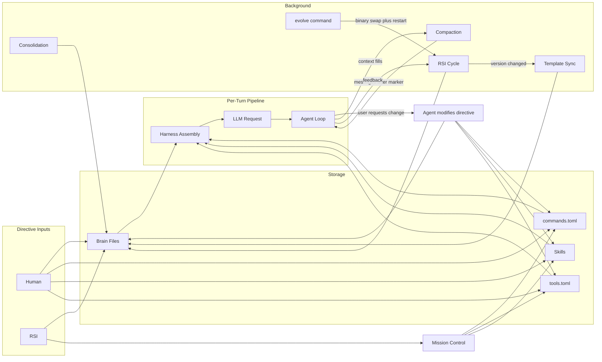
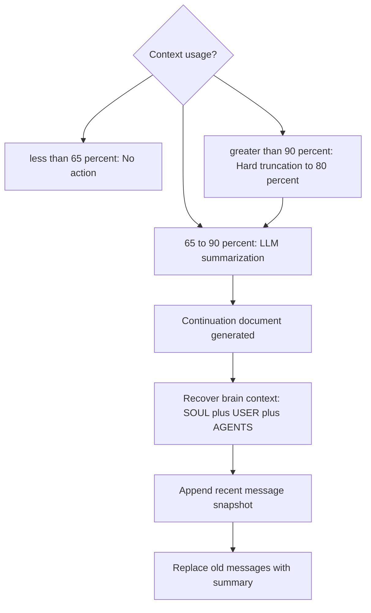
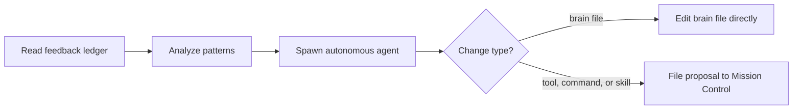
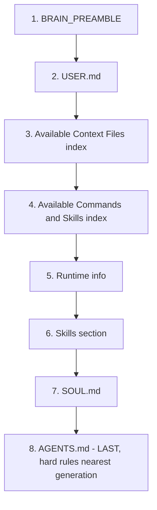

Brain Constitution — Canonical Placement Policy for OpenCrabs

# Brain Constitution — Directive Lifecycle for OpenCrabs

> **Status:** AS IS (current state of the system)
> **Purpose:** Single point of truth for what directive sources exist, how they enter the system, how the agent uses them, and how they are maintained over time.
> **Audience:** OpenCrabs developers, RSI engine authors, contributors.
> **Last updated:** 2026-06-21 — gaps #5/#6/#8/#9/#10 resolved, #1/#11 addressed at the directive level; AGENTS.md confirmed LAST in the prompt; ownership map single-sourced to the preamble + RSI taxonomy.

> **RULE: NEVER mix AS IS and TO BE states.** Every section describes the current codebase behavior (AS IS). If the current behavior is wrong or needs changing, file it as a Known Gap with the TO BE description and suggested action. Do NOT update the AS IS description to match the TO BE intent — the document must accurately reflect what the code DOES, not what it SHOULD do. This distinction is critical for developers reading the document to understand the actual system.

---

## 1. Glossary

| Term | Definition |
|------|-----------|
| **Directive** | Any piece of information that shapes the agent's behavior. Covers behavioral rules, tool definitions, skill workflows, commands, config, and project knowledge. |
| **Brain file** | A markdown file in `~/.opencrabs/` that shapes the agent's behavior. Each owns ONE kind of content, declared in its own `> Owns:` header (personality, user facts, hard rules, code standards, tools, security, etc. — see 2.1 / 2.2). Three are always loaded (core: `SOUL.md`, `USER.md`, `AGENTS.md`); the rest load on demand (contextual). |
| **Core brain file** | A brain file injected into every system prompt regardless of request content. Currently: `SOUL.md`, `USER.md`, `AGENTS.md`. |
| **Contextual brain file** | A brain file listed in the system prompt's "Available Context Files" index but only loaded when the agent explicitly calls `load_brain_file`. Currently: `CODE.md`, `TOOLS.md`, `SECURITY.md`, `MEMORY.md`, `BOOT.md`, `HEARTBEAT.md`. |
| **User-created brain file** | Any `.md` file in `~/.opencrabs/` not in the hardcoded core or contextual lists (e.g. `AGENTVERSE.md`, custom research notes). Treated as contextual. |
| **Skill** | A reusable multi-step workflow defined in a `SKILL.md` file with YAML frontmatter. Lives in `~/.opencrabs/skills/<name>/SKILL.md` (user) or embedded in the binary (built-in). |
| **Command** | A user-defined slash command defined in `commands.toml`. Maps a `/<name>` to a prompt or system action. |
| **Dynamic tool** | A runtime tool definition in `tools.toml`. Adds a callable tool to the agent's tool registry without recompiling. |
| **Harness** | The OpenCrabs binary's code that assembles the system prompt, manages sessions, routes tool calls, and handles channels. Not the agent, the infrastructure around it. |
| **System prompt** | The full prompt assembled by the harness and sent to the LLM at the start of each turn. Contains BRAIN_PREAMBLE + brain files + runtime info + skills. Sent alongside tool schemas (not embedded in the text). |
| **Tool schema** | A JSON object describing a tool's name, description, and input parameters. Sent to the LLM as a separate `tools` parameter in the API request, NOT embedded in the system prompt text. |
| **Core tool** | A tool whose schema is always sent to the LLM on every request (~22 tools: file I/O, bash, search, workflow, brain loader, config). Defined in `catalog.rs`. |
| **Extended tool** | A tool whose schema is only sent after the agent calls `tool_search` to discover and activate it (~70+ tools: browser, channels, media, agents). Lazy-loaded to save tokens. |
| **BRAIN_PREAMBLE** | A hardcoded `~14KB` string compiled into the binary. Contains tool call protocol, browser rules, formatting rules, RSI instructions, and response hygiene patterns. Always position 1 in the system prompt. |
| **Compaction** | The process of summarizing old messages when the context window fills up. At 65% usage, the LLM generates a "continuation document" that replaces older messages. At 90%, emergency hard truncation fires. |
| **Compaction marker** | A `[CONTEXT COMPACTION` text marker injected into the summary message. On session reload, messages before this marker are discarded; only messages after it are loaded. |
| **Recovered brain context** | After compaction, the harness re-injects SOUL.md (full), USER.md (full), and AGENTS.md (full) — identity plus the always-enforced hard rules. **RESOLVED (2026-06-21):** CODE.md and TOOLS.md are NO LONGER injected here (gaps #5/#6 fixed); like every other contextual file they load on demand via `load_brain_file`, and the always-present Available Context Files index keeps them discoverable. |
| **Recently accessed paths** | A persistent store of file paths the agent has confirmed via read/edit/grep/ls. Appended as an anchor section to the system brain each turn. Survives compaction (regenerated from the store, not from message history). |
| **RSI** | Recursive Self-Improvement. The autonomous background engine that analyzes feedback patterns and proposes improvements to brain files, tools, commands, and skills. |
| **Dedup scan** | A periodic scan that finds duplicate lines across brain files and files proposals to remove them. Runs every ~24 RSI cycles (~1 day). |
| **Template sync** | A version-gated process that merges upstream brain file templates into local files (append-only diffs). Runs when the OpenCrabs version changes. |
| **Mission Control** | The user-facing inbox for RSI proposals (tools, commands, skills). Users review and approve/reject proposals. |
| **Feedback ledger** | A SQLite database (`feedback.db`) that records tool successes/failures, user corrections, provider errors, and self-heal events. The RSI engine's primary data source. |
| **Project repo guidance** | Directive files the agent encounters in the user's working directory (e.g. `AGENTS.md`, `README.md`, `.cursorrules`). Not managed by OpenCrabs, authored by the user or other tools. |

---

## 2. Directive Sources — AS IS

### 2.1 Core Brain Files (always in system prompt)

| File | Role | Position in prompt | Approx size |
|------|------|--------------------|-------------|
| `USER.md` | User profile: identity, preferences, corrections, pet peeves | Position 2 (after BRAIN_PREAMBLE) | ~11KB |
| `AGENTS.md` | Workspace process + enforced hard rules / safety gates | LAST (after SOUL.md) | ~8KB |
| `SOUL.md` | Personality / voice only (how you sound) | Near end (just before AGENTS.md) | ~18KB |

These are the only brain files injected into every request. The agent cannot function without them. `AGENTS.md` is injected LAST (after `SOUL.md`), so the enforced hard rules sit closest to the model's generation point — the strongest spot against the "lost in the middle" attention decay; `SOUL.md` (personality/voice) sits just before it. `AGENTS.md` is always-loaded because it owns the enforced hard rules (safety/permission gates) — these must be in context every turn and survive compaction. SOUL.md was narrowed to personality/voice only (commit `9ca6182b`); hard rules live in AGENTS.md.

### 2.2 Contextual Brain Files (available on demand)

| File | Role | Loaded when |
|------|------|-------------|
| `CODE.md` | Coding standards, file organization, conventions | Agent writes code |
| `TOOLS.md` | Tool usage patterns, pitfalls, environment config | Agent uses tools |
| `SECURITY.md` | Security policies, incident response | Security-related requests |
| `MEMORY.md` | Long-term knowledge: facts, context, project state, integrations | Session starts, context recall |
| `BOOT.md` | Startup, memory-save triggers, upgrade/evolve, running as a service | First-time setup, new instances, or on demand |
| `HEARTBEAT.md` | Heartbeat tasks, background work | Heartbeat-related requests |

These files are listed in a "Available Context Files" index in the system prompt. The agent sees they exist and calls `load_brain_file` when relevant. They are NOT loaded by default, only when the agent explicitly requests them.

**Ownership-map headers (template governance):** Every brain file template now begins with a `> **Owns:**` header declaring what that file is the single source of truth for. This prevents rule duplication across files and gives RSI a clear routing signal. Example from BOOT.md: `> **Owns:** startup + runtime self-maintenance — boot steps, memory-save triggers, upgrade/evolve, running as a service.`

**What happens when the agent loads a contextual file:** The agent calls `load_brain_file("AGENTS.md")`. The harness reads the file from disk and returns its content as a tool result in the message history. The content appears once in the history. If the agent loads the same file again on a subsequent turn, it appears again as a new tool result. There is no deduplication of loaded brain file content across turns. The file content is NOT also injected into the system prompt (only the core files are in the system prompt).

**Why compaction loss is intentional, not a gap:** Contextual files are on-demand by design. Loaded when relevant, lost when context shrinks, re-fetched if needed again. This is the feature working correctly. After compaction, the system prompt (which contains the "Available Context Files" index) is reassembled fresh every turn from disk, so the agent always knows which files exist and can reload them. The recovered brain context reinjects SOUL.md, USER.md, and AGENTS.md as the baseline. CODE.md, TOOLS.md, SECURITY.md, MEMORY.md, and other contextual files are fetched on demand. **RESOLVED (2026-06-21):** CODE.md and TOOLS.md are no longer reinjected (gaps #5/#6 fixed).

**Note on deduplication within a session:** If the agent loads `AGENTS.md` on turn 2, that tool call + result persist in message history. On turn 5, the agent can see the content already loaded in its conversation history. It has no reason to call `load_brain_file("AGENTS.md")` again unless it needs a fresh copy (e.g. the user edited the file). After compaction, that history is wiped and the agent reloads from disk if needed. No session-level cache is needed because the agent's own history acts as the cache.

### 2.3 User-Created Brain Files

Any `.md` file in `~/.opencrabs/` that is NOT in the core or contextual lists is treated as a user-created contextual file. The harness discovers them via directory scan and lists them in the "Available Context Files" index with `(user-created)` tag.

Examples: `AGENTVERSE.md`, custom research notes.

These are NOT written to by RSI. If feedback relates to content in a user-created file, RSI suggests the change to the user instead of autonomously editing.

### 2.4 Skills

| Source | Location | Resolution order |
|--------|----------|-----------------|
| Built-in (7) | Embedded in binary at compile time | Loaded first |
| User | `~/.opencrabs/skills/<name>/SKILL.md` | Overrides built-in of same name |

Built-in skills: `cost-estimate`, `security-audit`, `repo-audit`, `browser-cdp`, `a2a-gateway`, `dynamic-tools`.

Format: YAML frontmatter (`name`, `description`, optional `review_gate: true`) + prompt body. The harness loads all skills and injects them into the system prompt as a skills section. A skill declaring `review_gate: true` gets a review-gate reminder prepended to its body on slash invocation: the agent presents the skill's output and waits for explicit user approval before any side effects, even under tool auto-approve — typing the slash is the user choosing to review first (natural-language requests that never touch the slash keep the usual flow). `/drop-release` is the first consumer.

RSI can propose new skills via `rsi_propose` (kind=`skill`). Proposals land in `~/.opencrabs/rsi/proposed_skills.toml` for human review.

### 2.5 Commands

| Source | Location | Format |
|--------|----------|--------|
| Built-in (~23) | Compiled into the binary | Hardcoded in `slash_command.rs` |
| User-defined | `~/.opencrabs/commands.toml` | `[[commands]]` TOML array |

Each command has: `name`, `description`, `action` (prompt/system), `prompt`.

Commands are now loaded on demand (contextual), not injected into every system prompt. The agent discovers them via the "Available Context Files" index or the user types `/` to see autocomplete.

RSI can propose new commands via `rsi_propose` (kind=`command`).

### 2.6 Tools

Tools are NOT directive content in the traditional sense. They do not appear in the system prompt text. Instead, tool schemas are sent as a separate `tools` parameter in every LLM API request.

#### 2.6.1 Built-in Tools (~100+)

Compiled into the binary as Rust `Tool` trait implementations. Registered in the `ToolRegistry` at startup.

**Lazy loading (token optimization):** Tools are split into two tiers:

| Tier | Count | When schemas are sent | Examples |
|------|-------|----------------------|----------|
| **Core** | ~22 | Every request, always | `read_file`, `write_file`, `edit_file`, `bash`, `ls`, `glob`, `grep`, `web_search`, `exa_search`, `memory_search`, `plan`, `task`, `http_client`, `load_brain_file`, `write_opencrabs_file`, `tool_search`, `slash_command`, `rename_session`, `follow_up_question` |
| **Extended** | ~70+ | Only after `tool_search` activates them | `browser_navigate`, `telegram_send`, `discord_send`, `slack_send`, `image_generate`, `session_spawn`, `cron_manage`, `self_improve`, etc. |

The agent calls `tool_search("send a telegram photo")` to discover and activate an extended tool. The tool's schema is then included in all subsequent requests for that session. This mirrors how contextual brain files work: core tools are always available, extended tools are loaded on demand.

#### 2.6.2 Dynamic Tools (`tools.toml`)

| Source | Location | Format |
|--------|----------|--------|
| Dynamic | `~/.opencrabs/tools.toml` | TOML tool definitions with executors |

Dynamic tools are loaded at startup and merged into the `ToolRegistry` alongside built-in tools. They add callable tools (HTTP endpoints, shell commands) without recompiling. They participate in the same core/extended tiering as built-in tools.

RSI can propose new tools via `rsi_propose` (kind=`tool`). Proposals land in `~/.opencrabs/rsi/proposed_tools.toml`.

#### 2.6.3 Tool Lifecycle in the Request

1. **Startup:** All built-in + dynamic tools registered in `ToolRegistry`
2. **Request assembly:** Harness calls `get_tool_definitions_filtered(active_extended)` to get schemas for core + any activated extended tools
3. **LLM call:** Schemas sent as `tools` parameter (separate from system prompt text)
4. **Agent calls tool:** Harness routes to `ToolRegistry::execute()`, which validates input, checks approval, and runs the tool
5. **Tool result:** Returned as `ToolResult` content block in message history
6. **Tool-name self-heal:** If the LLM calls a tool by a wrong name (e.g. `tg_send_message` instead of `telegram_send`), a fuzzy-match resolver attempts to fix it before returning an error

### 2.7 Cron Guidance

Cron jobs (`~/.opencrabs/cron.toml`) schedule recurring tasks. Each job has a `prompt` field, the directive that tells the agent what to do when the job fires. Jobs run in their own session with their own context.

There is no dedicated "cron directives" brain file. Cron guidance lives inline in the cron job definitions.

### 2.8 Project Repo Guidance (external, not managed by OpenCrabs)

The agent encounters these files when working in the user's codebase. They are NOT part of OpenCrabs, they are authored by the user, other AI tools, or project conventions.

| File | Common in | Purpose |
|------|-----------|---------|
| `AGENTS.md` | OpenCrabs projects | Workspace rules, project-specific directives |
| `README.md` | All projects | Project overview, setup, conventions |
| `CLAUDE.md` | Claude Code projects | Claude-specific directives |
| `.cursorrules` | Cursor projects | Cursor-specific directives |
| `.claude/` | Claude Code projects | Claude config directory |
| OKF spec files | Research projects | Research methodology and specs |

**Current state:** There is NO automatic discovery (the harness does not scan the working directory). **UPDATE (2026-06-21, commit `e3f20a64`):** the BRAIN_PREAMBLE now carries a PROJECT DIRECTIVES directive telling the agent to check for and read these files — including the other-harness ones (`CLAUDE.md`, `GEMINI.md`, `.github/copilot-instructions.md`, `.cursorrules`/`.cursor/rules`, `.windsurfrules`, `.clinerules`) — when working in a repo, and to re-read them after a compaction. The agent reads them with `read_file` / `glob`; automatic content injection remains a follow-up.

---

## 3. Directive Lifecycle — AS IS

### 3.1 Lifecycle Overview

#### Session-Time Directive Changes

During an active session, the user can request the agent to modify directives. The agent uses its tools to make the changes:

| User request | Agent tool | Target |
|-------------|-----------|--------|
| "Add a tool" | `write_opencrabs_file` or `tool_manage` | `~/.opencrabs/tools.toml` |
| "Add a skill" | `write_opencrabs_file` | `~/.opencrabs/skills/<name>/SKILL.md` |
| "Add a command" | `config_manager` or `write_opencrabs_file` | `~/.opencrabs/commands.toml` |
| "Add a cron job" | `cron_manage` or `write_opencrabs_file` | `~/.opencrabs/cron.toml` |
| "Update SOUL.md" | `write_opencrabs_file` | `~/.opencrabs/SOUL.md` |
| "Update MEMORY.md" | `write_opencrabs_file` | `~/.opencrabs/MEMORY.md` |

These changes take effect immediately. Brain files, TOML configs, and skills are re-read from disk every turn as part of system prompt assembly, so edits are live without restart.

#### Template Sync via /evolve

Template sync is version-gated: it runs when RSI detects that the OpenCrabs version has changed. The flow:

1. User runs `/evolve`
2. Binary is swapped and process restarts
3. On startup, RSI checks `SyncState::last_synced_version` against current `VERSION`
4. If they differ, `sync_templates()` runs: fetches upstream brain file templates and appends new sections (append-only, no overwrites)
5. Updates `last_synced_version`

Template sync can also be triggered manually via the `self_improve` tool with action `sync_templates`.

#### Compaction

**Note:** C6 reflects the current behavior after gaps #5/#6 were fixed (2026-06-21): only SOUL.md, USER.md, and AGENTS.md are re-injected; CODE.md and TOOLS.md load on demand.

#### RSI Cycle

#### Harness Assembly

**System prompt text** (sent as `system` parameter):

**Per-turn augmentations** (appended each turn):

**Tool schemas** (separate `tools` parameter, not in system prompt text):

### 3.2 Manual Composition

A human writes directives directly:

| Action | Tool | Target |
|--------|------|--------|
| Edit brain file | `write_opencrabs_file` | `~/.opencrabs/*.md` |
| Edit brain file manually | text editor | `~/.opencrabs/*.md` |
| Create skill | text editor | `~/.opencrabs/skills/<name>/SKILL.md` |
| Add command | `config_manager` or text editor | `~/.opencrabs/commands.toml` |
| Add dynamic tool | `tool_manage` or text editor | `~/.opencrabs/tools.toml` |
| Edit onboarding template | text editor | `~/.opencrabs/templates/` |
| Write project repo guidance | text editor | `AGENTS.md`, `README.md`, etc. in project dir |

### 3.3 Harness Assembly (system prompt composition)

Each turn, the harness assembles two things that go into the LLM request:

**A. System prompt text** (sent as `system` parameter):

| Position | Content | Source |
|----------|---------|--------|
| 1 | `BRAIN_PREAMBLE` | Hardcoded `~14KB` string in `prompt_builder.rs` (language-agnostic since commit `f67750a8`) |
| 2 | `USER.md` | Loaded from `~/.opencrabs/USER.md` |
| 3 | `AGENTS.md` | Loaded from `~/.opencrabs/AGENTS.md` (always-loaded since commit `7ffdf2d5`) |
| 4 | Available Context Files index | Directory scan of `~/.opencrabs/*.md` |
| 5 | Available Commands & Skills index | Live injection from `commands.toml` + `load_all_skills()` (commit `d0c4779f`) |
| 6 | Runtime info | Model, provider, working directory, version, OS, timestamp, known paths, compiled features |
| 7 | Skills section | Loaded from `~/.opencrabs/skills/` + built-ins |
| 8 | `SOUL.md` | Loaded from `~/.opencrabs/SOUL.md` (LAST for recency bias) |

**B. Tool schemas** (sent as `tools` parameter, separate from text):

Core tools (~22) always included. Extended tools (~70+) only if the session has activated them via `tool_search`. Dynamic tools from `tools.toml` are merged into the registry at startup and participate in the same tiering.

**C. Per-turn augmentations:**

| Augmentation | Where it appears | When |
|--------------|-----------------|------|
| Recently accessed paths anchor | Appended to system brain | Every turn (if paths exist in the persistent store) |
| Active plan reminder | Appended to user message | Every turn while a plan is executing (not stored in DB, regenerated from plan file) |

The harness also:
- Strips empty sections from brain files at read time (header stubs from prunes/dedup)
- Applies backup rotation (max 5 backups, max 7 days)
- Syncs templates from upstream on version change

### 3.4 Message History and Loaded Brain Files

**What is in message history:**
- User messages (persisted in DB)
- Assistant responses (persisted in DB)
- Tool call/result pairs (persisted in DB)
- Loaded brain file content appears as tool results when the agent calls `load_brain_file`

**What happens on the next turn:**
- The harness loads all messages from the last compaction marker forward from the database
- The system prompt is freshly assembled every turn (it is NOT stored in message history)
- Core brain files (SOUL.md, USER.md, AGENTS.md) are re-read from disk every turn and re-injected into the system prompt
- If the agent loaded `AGENTS.md` on turn 3 via `load_brain_file`, that content stays in message history as a tool result. On turn 4, it is still there in the messages. The agent can see it and has no reason to load it again unless the file changed on disk. After compaction, that history is wiped and the agent reloads from disk if needed.

**After compaction:**
- Messages before the compaction marker are gone from history
- The compaction summary (continuation document) replaces them as a single user message
- The recovered brain context re-injects SOUL.md (full), USER.md (full), and AGENTS.md (full). **RESOLVED (2026-06-21):** CODE.md and TOOLS.md are no longer injected here (gaps #5/#6 fixed); they load on demand like the other contextual files.
- Any contextual brain files the agent had loaded are gone from history. This is by design: contextual files are on-demand, loaded when relevant, lost when context shrinks. If the agent needs them again, it reloads them via `load_brain_file`. The system prompt (which contains the "Available Context Files" index) is reassembled fresh every turn, so the agent always knows which files exist.
- Recently accessed paths survive (regenerated from the persistent store, not from history)
- The system prompt is unchanged (it was never in message history)

### 3.5 Agent Decision-Making

The agent receives the assembled system prompt and uses directives to:

1. **Follow behavioral rules** — `AGENTS.md` hard rules, safety gates, workspace process
2. **Follow personality** — `SOUL.md` tone, voice, reasoning patterns
3. **Discover additional directives** — The "Available Context Files" index tells the agent which brain files exist. The agent calls `load_brain_file` when it determines the request needs that context.
4. **Discover additional tools** — The agent calls `tool_search` to find and activate extended tools not in the core set.
5. **Consult project repo guidance** — When working in a codebase, the agent may read `AGENTS.md`, `README.md`, or other project files via `read_file`. There is NO automatic discovery, the agent must find them by exploring.
6. **Execute skills** — When a task matches a skill's description, the agent runs the skill workflow.
7. **Execute commands** — When the user types `/<name>`, the framework routes to the command definition.

### 3.6 Compaction

Compaction is the process of summarizing old messages when the context window fills up. It is NOT a brain-file process, it operates on message history. But it directly affects which directives survive across sessions.

#### Triggers

| Threshold | Action | Behavior |
|-----------|--------|----------|
| <65% | None | Normal operation |
| 65% (soft trigger) | LLM compaction | Spawns a summarizer LLM that reads old messages and generates a "continuation document". Up to 3 retry attempts. If still over 65% after success, re-compacts once more. |
| 90% (hard floor) | Emergency truncation | Hard-cuts messages to 80% immediately. Then falls through to LLM compaction for the remaining content. This path NEVER fails. |

#### What is lost

- All message history before the compaction marker
- Tool call/result pairs (including loaded brain file content from `load_brain_file`)
- Loaded contextual brain file content (AGENTS.md, CODE.md, etc.) — by design: on-demand files are fetched when relevant, lost when context shrinks, re-fetched if needed again
- The exact wording of user messages and assistant responses
- Reasoning/thinking content

#### What is reinjected

| Component | Source | How |
|-----------|--------|-----|
| Continuation document | Generated by summarizer LLM | Prepended as a single user message with `[CONTEXT COMPACTION` marker |
| SOUL.md (full) | `~/.opencrabs/SOUL.md` | Read from disk, prepended to summary as "recovered brain context" |
| USER.md (full) | `~/.opencrabs/USER.md` | Read from disk, prepended to summary |
| AGENTS.md (full) | `~/.opencrabs/AGENTS.md` | Read from disk, prepended to summary (always-loaded since v0.3.46) |
| Recent message snapshot | Last 8 messages from pre-compaction history | Appended to summary as "Recent Message Pairs" |
| Recently accessed paths | Persistent store | Regenerated from disk (not from history), appended to system brain |
| Active plan reminder | Plan file on disk | Regenerated from plan file each turn (never in message history) |

#### What is NOT reinjected (loaded on demand if needed)

- CODE.md, TOOLS.md, SECURITY.md, MEMORY.md, BOOT.md, HEARTBEAT.md (all contextual)
- User-created brain files (AGENTVERSE.md, etc.)
- Skill definitions (skills section is in the system prompt, which survives compaction)
- Commands (commands.toml is loaded at startup, not in message history)
- Tool schemas (sent as separate parameter, not in message history, survive compaction)

**Note on TOOLS.md and CODE.md:** **RESOLVED (2026-06-21, commit `a37820cb`).** These are NO LONGER reinjected after compaction (gaps #5/#6 fixed); they load on demand. The recovered baseline is SOUL.md + USER.md + AGENTS.md.

#### Session restart vs compaction

On session restart (new process, no compaction marker):
- All messages are loaded from DB
- System prompt is freshly assembled
- No recovered brain context is needed (system prompt already has core files)

On session restart after compaction:
- Only messages from the compaction marker forward are loaded
- The first message is the continuation document + recovered brain context
- The agent wakes up with its identity and recent context, but older history is gone

### 3.7 RSI (Recursive Self-Improvement)

The RSI engine runs as a background task, one cycle per hour:

1. **Collects feedback** from the feedback ledger (SQLite `feedback.db`):
   - Tool failures with >20% failure rate over 7 days
   - User corrections (3+ entries)
   - Provider errors (3+ entries)
   - High-frequency bash patterns (>15 invocations/day)
2. **Deduplicates** against previous cycle (SHA-256 hash of opportunities). Skips if identical.
3. **Spawns an autonomous agent** with a restricted tool set: `feedback_analyze`, `feedback_record`, `self_improve`, `rsi_propose`.
4. **Routes improvements** to the correct brain file based on the RSI Agent Taxonomy:

| Issue type | Routes to |
|-----------|-----------|
| Hard rules / safety gates | `AGENTS.md` (always-loaded) |
| Behavior, tone, personality | `SOUL.md` (personality/voice only) |
| Workspace process | `AGENTS.md` |
| Tool usage patterns | `TOOLS.md` |
| User preferences, corrections | `USER.md` |
| Knowledge gaps, context | `MEMORY.md` |
| Code quality / language preference | `CODE.md` |
| Security issues | `SECURITY.md` |
| Startup / upgrade / service | `BOOT.md` |
| Multi-step workflows | Skills (proposal) |
| Missing tools | `tools.toml` (proposal) |
| Missing commands | `commands.toml` (proposal) |

5. **Brain file changes** are applied autonomously (no human approval needed). Logged to `~/.opencrabs/rsi/improvements.md` and archived to `~/.opencrabs/rsi/history/`.
6. **Tool/command/skill proposals** land in `~/.opencrabs/rsi/proposed_*.toml` for human review via Mission Control.

### 3.8 Consolidation and Deduplication

| Process | Frequency | What it does | Auto-applies? |
|---------|-----------|-------------|---------------|
| **Dedup scan** | Every ~24 RSI cycles (~1 day) | Finds duplicate lines across 10 brain files, files proposals | No, human reviews in Mission Control |
| **Template sync** | On version change | Merges upstream brain file templates (append-only diffs) | Yes, append-only, no overwrites |
| **Empty section strip** | At read time | Removes header stubs (empty bodies) from loaded view | Yes, read-time filter, disk unchanged |
| **Backup rotation** | On write | Keeps max 5 backups per file, max 7 days old | Yes |
| **Append-only enforcement** | Always | Brain files can only grow. Shrinking requires `cleanup_intent=true` with user approval | Enforced |
| **Template governance tests** | On every commit | 15 `cargo test` guards enforcing: ownership-map headers on all rule templates, single-source-of-truth (no rule duplicated across files), no personal/user file names in templates, deleted templates (VOICE.md, BOOTSTRAP.md) stay deleted, BOOT.md is seeded | Enforced by CI |

**Canonical file rank** (historical reference for file precedence):

| Rank | File | Rationale |
|------|------|-----------|
| 0 | `SOUL.md` | Identity-shaping, most authoritative |
| 1 | `AGENTS.md` | Workspace rules, safety |
| 2 | `TOOLS.md` | Tool usage patterns |
| 3 | `CODE.md` | Coding standards |
| 4 | `SECURITY.md` | Security policies |
| 5 | `MEMORY.md` | Long-term memory |
| 6 | `USER.md` | User profile |
| MAX | Everything else | User-created files, skills |

When evaluating overlapping content across brain files, the lowest-ranked file takes precedence.

---

### Removed Files

| File | Status | Reason |
|------|--------|--------|
| `BOOTSTRAP.md` | **Deleted** (commit `a97df0c7`) | Replaced by BOOT.md's first-time setup section. First-time onboarding guidance consolidated into BOOT.md. |
| `VOICE.md` | **Deleted** (commit `a5eac082`) | Unused template. TTS/STT configuration is handled by the framework, not by a brain file. |
| `IDENTITY.md` | **Deleted** (predates this ledger) | Folded into `SOUL.md`, which owns identity and voice. Never had a template and is in no brain-file list. Its absence from this table is why stale references to it survived in the setup docs and README long after `VOICE.md` and `BOOTSTRAP.md` were cleaned up (#991). The name still appears in `src/cli/migrate.rs`, correctly: that list describes an Openclaw workspace being migrated FROM, and Openclaw did have one. |

## 4. Known Gaps (AS IS)

These are places where the current system does not have a canonical policy or has incomplete coverage:

1. **No automatic project-repo discovery.** The agent does not scan the working directory for `AGENTS.md`, `CLAUDE.md`, `.cursorrules`, or OKF spec files. It must be told they exist or find them by exploring. **Verified STILL ACTUAL (2026-06-21):** Zero hits for CLAUDE.md/.cursorrules/project-directive scanning in `src/brain/`. `services/project.rs` is CRUD only — no directive discovery. **🟡 PARTIALLY ADDRESSED (2026-06-21, commit `e3f20a64`):** — the BRAIN_PREAMBLE now carries a PROJECT DIRECTIVES directive telling the agent to read a repo's OTHER-harness rule files (`CLAUDE.md`, `GEMINI.md`, `.github/copilot-instructions.md`, `.cursorrules` / `.cursor/rules`, `.windsurfrules`, `.clinerules`, and the cross-tool `AGENTS.md` — distinct from the `~/.opencrabs/AGENTS.md` brain file). Automatic content injection (scanning the working dir and inlining the files) remains a possible follow-up.

2. **No unified directive policy.** RSI routes improvements based on the RSI Agent Taxonomy (embedded in the RSI system prompt). These systems are governed by the preamble + RSI level policy. **Updated (2026-09-14, #204):** retired brain dedup scanner. `CONTEXTUAL_BRAIN_FILES` and `CORE_BRAIN_FILES` are separate hardcoded arrays in `prompt_builder.rs`. No unified policy document or config governs them. **Decision (2026-06-21):** no separate *enforcement* document (this Constitution documents it). The ownership map is maintained at TWO always-present prompt levels, because the main agent and the RSI agent get DIFFERENT prompts: the **BRAIN_PREAMBLE** (main agent) and the **RSI taxonomy inside `RSI_AGENT_PROMPT`** (the RSI agent — confirmed `rsi.rs:475`, it does NOT receive the preamble). Each intentionally carries the map and they are kept consistent — that is the 'preamble + RSI level' policy. Per-file `> Owns:` headers are one-line self-labels, not a competing policy. AGENTS.md's header NO LONGER restates the full routing map (that was a redundant third copy — removed; the preamble owns the map).

3. **Cron directives are isolated.** **✅ NON-GAP (2026-06-21) — the original verification was wrong.** Cron jobs DO run with the full brain: the scheduler builds it (`build_core_brain` at `scheduler.rs:382`, `with_system_brain` at `:390`) for foreign-profile jobs, and reuses the factory agent (which already carries the system brain) for local-profile jobs. So cron tasks are NOT isolated from the directive system — they get SOUL/USER/AGENTS + the preamble like any other session. There is no dedicated `CRON.md`, and none is needed: per-job behavior lives in each job's `prompt`, and the cron expression format is owned by the `cron_manage` tool + TOOLS.md.

4. **No TO BE state defined.** This document captures the current state. The desired future state (what should change) is TBD. **Verified DOCS GAP (2026-06-21):** Meta-documentation issue, not a code issue. The document itself defines AS IS; TO BE is intentionally left as TBD.

5. **CODE.md injected after compaction.** **✅ RESOLVED (2026-06-21, commit `a37820cb`).** `build_recovered_brain_context()` no longer injects a CODE.md summary; the `CODE_MD_SUMMARY` constant was deleted. CODE.md is contextual and loads on demand via `load_brain_file` when the task involves code — AGENTS.md (always re-injected) carries the directive "If writing code: Read CODE.md".

6. **TOOLS.md injected after compaction.** **✅ RESOLVED (2026-06-21, commit `a37820cb`).** TOOLS.md was removed from the `full_files` array; the recovered context is now SOUL.md, USER.md, AGENTS.md only. TOOLS.md (each user's customized tool notes) loads on demand like the other contextual files, and `tool_search` handles tool discovery.

**Note on gaps #5 and #6:** **✅ RESOLVED (2026-06-21, commits `a37820cb`, `17075a23`).** `build_recovered_brain_context()` now re-injects only SOUL.md, USER.md, and AGENTS.md. The redundant contextual-files pointer was dropped too — AGENTS.md (re-injected) plus the always-present Available Context Files index keep CODE/TOOLS/etc. discoverable on demand. One source, no duplication.

7. **Contextual file content deduplication in message history (possible optimization).** When the agent loads a contextual file via `load_brain_file`, the content appears as a tool result in message history. If the agent loads the same file again on a later turn, a second copy appears. For code files especially, repeated edit/read cycles can quickly drain the context window. There is no deduplication of loaded brain file content across turns. **Current mitigation:** The agent can see its own tool call history and has no reason to reload a file already in context (unless the file changed on disk). After compaction, history is wiped and files are reloaded from disk if needed. **Note:** Adolfo considers this a non-gap in practice ("Is a gap only if it loads again while its in context which makes no sense at all"). Alexey flagged it as a possible optimization for cases involving repeated code file edits. **Open question:** Should deduplication apply when different fragments of the same file are present in history (from partial reads)? This needs further analysis. **Verified STILL ACTUAL (2026-06-21):** No message-history dedup found. File-level safety in `brain_file_safety.rs` handles write-time shrink protection, not loaded content in conversation history.

8. **Commands discovery.** **✅ RESOLVED** (commit `d0c4779f`). The prompt builder now injects a compact "Available Commands & Skills" section (commands.toml + load_all_skills()) into the system prompt every turn. AGENTS.md (always-loaded) gains a "Commands & Skills" section explaining the mechanism. The agent sees all available commands and skills at startup without needing to load anything. **Verified RESOLVED (2026-06-21):** `push_commands_and_skills` method exists at `prompt_builder.rs:512`, called from `build_core_brain` (line 294) and `build_system_brain` (line 442). Loads `commands.toml` via `CommandLoader::from_brain_path` and skills via `load_all_skills()`. Injects a compact "--- Available Commands & Skills ---" section. Gated on existence — nothing added when empty.

   **Implementation:** In `build_core_brain()` and `build_system_brain()`, read `commands.toml` + `load_all_skills()`, format as a short index, inject after the Available Context Files index. This is the same pattern used for contextual brain files: the agent sees what exists and can use it when relevant.

9. **Proactive tool discovery.** The BRAIN_PREAMBLE says: "call `tool_search` FIRST with a short description of what you need. NEVER say you can't do something before searching for the tool." This is **reactive**: search when you need something specific. There is **no proactive directive**: "at task start, discover tools that might help with this task." The agent only searches for tools when it encounters a problem it can't solve with core tools. **Verified STILL ACTUAL (2026-06-21):** `tool_search` exists at `tools/tool_search.rs` but is reactive only. No proactive discovery mechanism found in `prompt_builder.rs` or `BRAIN_PREAMBLE`. The preamble says "NEVER say you can't do something before searching for the tool" — this is a refusal-avoidance directive, not a proactive discovery directive. **✅ RESOLVED (2026-06-21, commit `e3f20a64`):** the BRAIN_PREAMBLE now has a PROACTIVE TOOL DISCOVERY directive — call `tool_search` with the task domain at the START of a non-trivial task, not only when stuck (Option A).

   **Suggested action:** Two options (not mutually exclusive):
   - **Option A (preamble reinforcement):** Add to BRAIN_PREAMBLE: "At the start of any non-trivial task, call `tool_search` with a short description of the task domain to discover relevant tools before starting work."
   - **Option B (phantom detector extension):** Extend the existing phantom detector to catch refusal patterns ("I can't", "I don't have access to", "I don't have a tool for", "I'm unable to"). When detected, force a `tool_search` call before allowing the response. This is an app-level enforcement that works regardless of model compliance.
   - **Recommendation:** Implement both. Option A is a directive (soft enforcement). Option B is a self-heal (hard enforcement). Together they cover both model compliance and model non-compliance.

10. **Project-level directives (agent knowing to check).** No directive found in BRAIN_PREAMBLE, AGENTS.md, TOOLS.md, BOOT.md, or CODE.md telling the agent to check for project-level directives (`AGENTS.md`, `CLAUDE.md`, `.cursorrules`) when entering a project directory. The agent would have to explicitly `ls` or `glob` to discover them. If it doesn't, it never knows they exist. This is related to but distinct from gap #1 (no automatic project-repo discovery): gap #1 is about the system not loading them automatically, this gap is about the agent not having a directive to check. **Verified STILL ACTUAL (2026-06-21):** No project-directive scanning in `prompt_builder.rs` or `BRAIN_PREAMBLE`. The prompt mentions "AGENTS.md for project conventions" in passing (line 130) but has no directive to scan the working directory for project-level files. **✅ RESOLVED (2026-06-21, commit `e3f20a64`):** the PROJECT DIRECTIVES preamble directive tells the agent to read a repo's OTHER-harness rule files (CLAUDE.md / Cursor / Copilot / Gemini / Windsurf / Cline / cross-tool AGENTS.md) when working in it.

   **Research context:** Claude Code solves this by automatically loading ALL CLAUDE.md files at session start (user-level `~/.claude/CLAUDE.md`, project root `./CLAUDE.md`, directory-level `./src/CLAUDE.md`). The agent never has to discover them. Cursor solves this with 4 rule activation modes: Always (every request), Auto Attached (glob-based file matching), Agent Requested (AI decides), Manual (explicit @mention). OpenCrabs has neither mechanism.

   **Suggested action:** Implement automatic project-level directive discovery in `build_system_brain()`. When the system prompt is assembled, scan the working directory for known directive files (`CLAUDE.md`, `AGENTS.md`, `.cursorrules`, `.cursor/rules/*.mdc`). If found, inject them into the system prompt as a "Project Rules" section (between Available Context Files and Runtime Info). Track injected paths in the "recently accessed paths" mechanism so they survive compaction. This is the Claude Code approach: automatic, hierarchical, no agent action needed.

11. **Project-level directive persistence across compaction.** The agent discovers project-level directives (CLAUDE.md, AGENTS.md, .cursorrules) when it enters a project directory. After compaction, these are lost from context. The "recently accessed paths" mechanism tracks brain file paths from `~/.opencrabs/` but NOT project-level directive paths from the working directory. The agent has to re-discover them from scratch after every compaction. This is Alexey's reported issue: "the agent may discover them and update them during a session and then forget about it later in the session." **Verified STILL ACTUAL (2026-06-21):** `build_recovered_brain_context()` at `context.rs:218` loads SOUL.md, USER.md, AGENTS.md, TOOLS.md from disk + CODE.md summary. No project-level directive scanning. The working directory is known from session state but not used to scan for project files. **✅ RESOLVED at the directive level (2026-06-21, commit `e3f20a64`):** the PROJECT DIRECTIVES directive lives in the always-present preamble (survives compaction) and explicitly says to RE-READ the project files after a compaction. System-level auto-reinjection of their content is a possible follow-up.

   **Suggested action:** Two-part fix:
   - **Part 1 (system-level):** In `build_recovered_brain_context()`, after loading SOUL.md/USER.md/TOOLS.md/CODE.md, also scan the working directory for project-level directives and reinject them. The working directory is known from session state.
   - **Part 2 (directive-level):** Add to the compaction recovery preamble: "If you were working in a project directory, re-read any project-level directives (CLAUDE.md, AGENTS.md, .cursorrules) from that directory before continuing."
   - **Recommendation:** Part 1 is the robust fix (system guarantees persistence). Part 2 is a safety net (agent is reminded to check). Implement both.

12. **No Cursor-style rule activation modes.** OpenCrabs brain files are either "always in context" (SOUL.md, USER.md, AGENTS.md) or "contextual (loaded on demand)" (everything else). There is no intermediate activation. Cursor has 4 modes: Always, Auto Attached (glob-based file matching), Agent Requested (AI decides whether to load), Manual (explicit @mention only). This allows fine-grained control over what's in context and when. **Verified STILL ACTUAL (2026-06-21):** No activation mode system found. Brain files are binary: `CORE_BRAIN_FILES` + `ALWAYS_LOADED_FILES` (always) vs `CONTEXTUAL_BRAIN_FILES` (on demand). No intermediate modes. No frontmatter parsing for mode metadata. No `config.toml` section for brain file modes.

   **Suggested action:** Add activation mode metadata to brain files (via frontmatter or a config). Modes:
   - `always` — always in system prompt (SOUL.md, USER.md, AGENTS.md)
   - `auto_attached` — included when specific files/tools are used (e.g., SECURITY.md activates when doing security-sensitive operations)
   - `agent_requested` — agent decides whether to load based on task description
   - `manual` — only loaded when explicitly mentioned

   This would allow, e.g., SECURITY.md to only activate when the agent is doing security-sensitive operations, or CODE.md to only activate when editing code files. Implementation: add a `[brain_file_modes]` section to `config.toml` or add frontmatter to brain files.

---

## 5. File Inventory

| File | Type | Load behavior | Approx size |
|------|------|---------------|-------------|
| `SOUL.md` | Core brain file | Always (near end, before AGENTS.md) | ~18KB |
| `USER.md` | Core brain file | Always (position 2) | ~11KB |
| `AGENTS.md` | Core brain file | Always (LAST, after SOUL.md) | ~8KB |
| `CODE.md` | Contextual brain file | On demand | ~6KB |
| `TOOLS.md` | Contextual brain file | On demand | ~14KB |
| `SECURITY.md` | Contextual brain file | On demand | ~4KB |
| `MEMORY.md` | Contextual brain file | On demand | ~varies |
| `BOOT.md` | Contextual brain file | First-time setup / on demand | ~3KB |
| `HEARTBEAT.md` | Contextual brain file | On demand | ~2KB |
| `commands.toml` | Command definitions | Loaded at startup | ~varies |
| `tools.toml` | Dynamic tool definitions | Loaded at startup | ~varies |
| `skills/*/SKILL.md` | Skill workflows | Loaded at startup (all) | ~varies |
| `cron.toml` | Cron job definitions | Loaded at startup | ~varies |
| `templates/*.hbs` | Onboarding templates | Loaded on `/onboard` | ~varies |
| `research/*.md` | Research docs | Manual reference only | ~varies |
| `rsi/proposed_*.toml` | RSI proposals inbox | Loaded by Mission Control | ~varies |
| `rsi/improvements.md` | RSI applied improvements log | Append-only | ~varies |
| `rsi/history/*.md` | RSI daily archives | Append-only | ~varies |

---

## 6. Maintenance Process

This document requires periodic review to stay accurate as the codebase evolves. Reviews are performed by spawning separate subagent reviewers, each with a specific focus.

### 6.1 Review Protocol

Each review spawns 3 independent subagents:

| Reviewer | Focus | What it checks |
|----------|-------|---------------|
| **A: Structure** | Section order and composition | Sections in wrong order, sections that should be split or combined, missing cross-references, misplaced content that belongs in a different section |
| **B: Discrepancies** | Internal contradictions | Statements that contradict each other, AS IS descriptions that conflict, glossary terms not matching usage, mermaid diagrams not matching text descriptions |
| **C: Scope creep** | Excessive detail in overview sections | Overview sections containing implementation details that belong in specialized sections or addendums, verbose explanations where a cross-link would suffice |

### 6.2 Review Execution

1. Spawn reviewer A with the full document and instructions to report structural issues
2. Spawn reviewer B with the full document and instructions to find contradictions
3. Spawn reviewer C with the full document and instructions to flag scope creep
4. Collect all 3 reports
5. Apply fixes that are clearly correct (structural moves, removing contradictions)
6. Flag ambiguous issues for human review
7. Update the document and gist

### 6.3 Review Frequency

Reviews should run:
- After any significant codebase change that affects directive lifecycle
- After any new Known Gap is added
- On request from any contributor
- Periodically (monthly) as a health check

---

## Appendix A: Mermaid Rendering on GitHub

Known issues when rendering Mermaid diagrams on GitHub:
- Parentheses `()` in node labels break rendering. Must wrap labels in double quotes: `A["text with (parens)"]`
- Plus `+`, at `@`, angle brackets `<>`, curly braces `{}`, square brackets `[]` break rendering in unquoted labels
- `$$` is interpreted as math mode by GitHub's markdown processor before Mermaid parses
- Large diagrams with many nodes may fail to render
- Always test Mermaid diagrams on GitHub before merging

---

---

## Appendix B: v0.3.46 Sync Changelog (2026-06-21)

34 commits reviewed from `origin/main` since the gist's first version (2026-06-20T13:17:50Z). 22 were brain-relevant.

### Brain-relevant commits

| SHA | Category | Summary |
|-----|----------|---------|
| `7ffdf2d5` | Brain files | AGENTS.md promoted to always-loaded (separate `ALWAYS_LOADED_FILES` constant, injected near end of prompt) |
| `887ef8b4` | Brain files / RSI | Hard rules routed to always-loaded AGENTS, not SOUL |
| `9ca6182b` | Brain files | SOUL.md narrowed to personality/voice only |
| `98ca35d3` | Brain files / RSI | Brain-file ownership model in preamble + RSI taxonomy |
| `0bb76c9b` | Brain files | Ownership-map headers on each brain file template |
| `dd64fa12` | Brain files | Single-source-of-truth seed brain files |
| `d0c4779f` | Prompt composition | Live commands & skills index injection (gap #8 resolved) |
| `ecce87b0` | Brain files | Post-compaction CODE summary made language-agnostic |
| `f67750a8` | Brain files | Preamble/RSI no longer impose Rust — language pref is CODE.md's |
| `a5eac082` | Brain files | VOICE.md template removed |
| `a97df0c7` | Brain files | BOOTSTRAP.md dropped, BOOT.md now seeded |
| `12e23bfe` | Brain files | Governance tests for template structure |
| `4f4c00bd` | Search | Glob walk bounded: symlink-safe, 30s timeout, 500k entry cap |
| `8e0e36d5` | Cron | Timezone support (DST-aware), next-run feedback, format docs |
| `6f762022` | Prompt composition | AGENTS.md moved to LAST injection position (after SOUL.md) — hard rules nearest generation |
| `a37820cb` | Compaction | Stop re-injecting TOOLS.md + CODE.md after compaction (gaps #5/#6 resolved) |
| `17075a23` | Compaction | Drop redundant contextual-files pointer; AGENTS.md owns the directive |
| `cc689374` | Prompt composition | Default-profile statement + profile/project runtime directives in Known paths |
| `bc40d32a` | Cron | Discord and Slack result delivery |
| `e32fd4b1` | Phantom detector | Catches work announcements ending with colon after 'now' |

### Non-brain commits (noted for completeness)

| SHA | Category | Summary |
|-----|----------|---------|
| `623debb9` | Plan tool | Redesigned from 13 commands to 4: `init`, `add_task`, `start`, `complete` |
| `8d6d3f7c` | Plan tool | Test suite updated for 4-command model |
| `eb75c3d3` | Projects | Local file shares → symlink; ephemeral → copy |
| `aa6ebaab` | Channels | TUI takes priority over running daemon |
| `ee108af6`+ | Channels | /cd directory browser |
| `187d689e` | Voice | TTS timeout fix for long text |
| `571ab10a` | Evolve | Sweep stale transient restart units |

### Key architectural changes

1. **Always-loaded tier expanded:** SOUL + USER → SOUL + USER + **AGENTS** (3 files). AGENTS.md lives in a separate `ALWAYS_LOADED_FILES` constant (not `CORE_BRAIN_FILES`), injected near the end of the system prompt alongside SOUL.md.
2. **SOUL.md ownership narrowed:** personality/voice only; hard rules → AGENTS.md
3. **Commands/skills visible at startup:** injected into system prompt every turn via `push_commands_and_skills`
4. **Preamble language-agnostic:** no Rust imposition; language pref lives in CODE.md only
5. **Glob bounded:** no more 16-minute hangs on deep trees

### Known Gaps verified (2026-06-21)

| Gap | Status | Evidence |
|-----|--------|----------|
| #1 (Project-repo discovery) | **🟡 PARTIAL** | PROJECT DIRECTIVES directive in BRAIN_PREAMBLE (`e3f20a64`); full content auto-injection is the follow-up |
| #2 (Unified directive policy) | **🔵 DECIDED** | Ownership at preamble + RSI taxonomy (two agent prompts); AGENTS header routing-tail removed |
| #3 (Cron directives isolated) | **✅ NON-GAP** | Cron jobs run with the full brain (`build_core_brain` at `scheduler.rs:382`) — original verification was wrong |
| #4 (No TO BE state) | **📄 DOCS** | Meta-documentation, not code |
| #5 (CODE.md after compaction) | **✅ RESOLVED** | `CODE_MD_SUMMARY` deleted (`a37820cb`) |
| #6 (TOOLS.md after compaction) | **✅ RESOLVED** | TOOLS.md removed from `full_files` (`a37820cb`) |
| #7 (Content deduplication) | **✅ NON-GAP** | Per Adolfo; only matters if reloading while in context |
| #8 (Commands discovery) | **✅ RESOLVED** | `push_commands_and_skills` in `prompt_builder.rs` |
| #9 (Proactive tool discovery) | **✅ RESOLVED** | PROACTIVE TOOL DISCOVERY directive in BRAIN_PREAMBLE (`e3f20a64`) |
| #10 (Project-level directives) | **✅ RESOLVED** | PROJECT DIRECTIVES directive (`e3f20a64`) |
| #11 (Project persistence) | **✅ RESOLVED (directive)** | Directive in always-present preamble + re-read after compaction (`e3f20a64`); auto-reinjection is the follow-up |
| #12 (Rule activation modes) | **🔴 STILL ACTUAL** | Binary always/contextual only (recommended: defer — big feature) |

---

*This document is the AS IS state. All descriptions reflect what the code actually DOES. Known Gaps document where the code diverges from the intended behavior, with TO BE descriptions and suggested actions. TO BE state (canonical placement policy, unified directive routing, project-repo auto-discovery) is TBD.*

